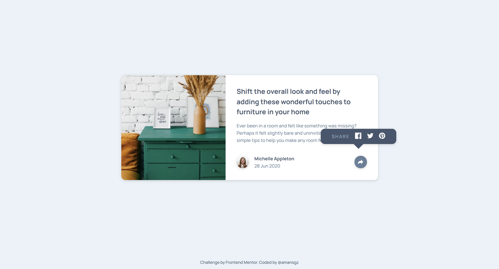

# Frontend Mentor - Article Preview Component

This is a solution to the [Article preview component challenge on Frontend Mentor](https://www.frontendmentor.io/challenges/article-preview-component-dYBN_pYFT).

## Table of contents

- [Overview](#overview)
  - [The challenge](#the-challenge)
  - [Screenshot](#screenshot)
  - [Links](#links)
- [My process](#my-process)
  - [Built with](#built-with)
  - [What I learned](#what-i-learned)
  - [Continued development](#continued-development)
  - [Useful resources](#useful-resources)
- [Author](#author)
- [Acknowledgments](#acknowledgments)

## Overview

### The challenge

- Build the optimal layout for the site depending on their device's screen size that closely matches the provided design.
- See the social media share links when they click the share icon.

### Screenshot

### Links

- Live site: [View here](https://amansgz.github.io/fem-solutions/article-preview-component)
- Solution URL: [https://www.frontendmentor.io/solutions/article-preview-component-](https://www.frontendmentor.io/solutions/article-preview-component-)

## My process

### Built with

- Semantic HTML5 markup
- BEM Methodology
- CSS Custom Properties
- Flexbox
- Mobile-first workflow
- JavaScript

### What I Learned

**Interactive social media nav with tooltip transformation**

- Transformed the social media nav into an elegant tooltip for desktop.
- Used CSS positioning for precise tooltip placement.
- Implemented the smooth transitions and the "speech bubble" triangle effect with borders.
- Manage active states for the share button using JavaScript class toggles.

### Continued development

I want to continue learning JavaScript and explore new ways to improve my code and build better projects.

### Useful resources

- [JavaScript Fundamentals](https://www.frontendmentor.io/learning-paths/javascript-fundamentals-oR7g6-mTZ) - This challenge is part of Frontend Mentor's learning path. The challenges in this path are designed to guide you through handling common user interactions with JavaScript.

## Author

- Frontend Mentor - [@amansgz](https://www.frontendmentor.io/profile/amansgz)
- Github - [@amansgz](https://www.github.com/amansgz)

## Acknowledgments

[Frontend Mentor](https://www.frontendmentor.io) for providing this challenge and helping developers improve their skills through realistic projects.
